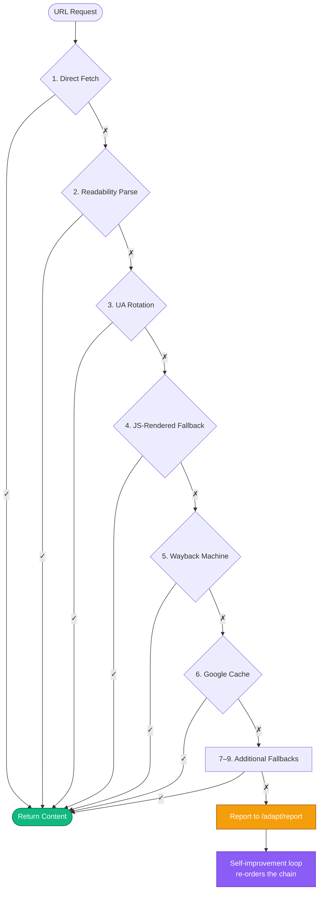
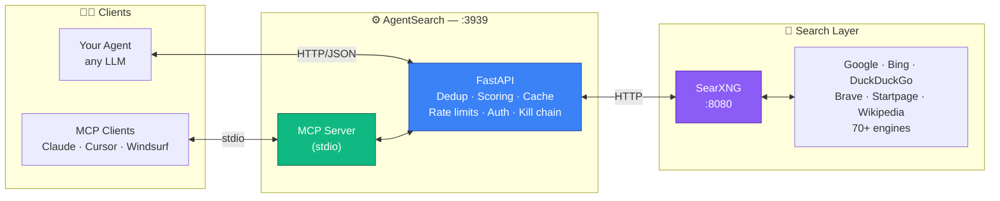

<div align="center">

# 🔍 AgentSearch

**[Quick Start](#-quick-start) · [Features](#-why-agentsearch) · [API](#-api-reference) · [MCP Server](#mcp-claude-desktop-cursor-windsurf) · [Architecture](#️-architecture) · [FAQ](#-faq)**

</div>

<br />

---

## ⚡ Quick Start

Three commands. One endpoint. No API keys, no quotas, no vendor lock-in.

```bash
git clone https://github.com/brcrusoe72/agent-search.git
cd agent-search
docker compose up -d
```

```bash
curl "http://localhost:3939/search?q=distributed+consensus+algorithms&count=5"
```

That's it. You now have a deduplicated, multi-engine, LLM-ready search API running at `http://localhost:3939`.

### Terminal Demo

For a reproducible terminal GIF workflow using the real AgentSearch quick-start commands, see [`docs/TERMINAL_GIF_GUIDE.md`](docs/TERMINAL_GIF_GUIDE.md) and the tapes in `docs/demo/`.

<br />

## 🎯 Why AgentSearch?

You could call SearXNG directly. Most people building serious agent infrastructure end up writing this layer anyway. AgentSearch is that layer, already built.

<table>
<tr>
<td width="50%" valign="top">

### 🧠 LLM-Native Output
Structured JSON with typed fields, scores, and metadata. No HTML scraping, no regex, no post-processing. Drop it straight into your agent's context.

</td>
<td width="50%" valign="top">

### 🎯 Cross-Engine Scoring
Results are deduplicated and ranked by how many engines agree. Position 1 is position 1 for a reason — not an artifact of one engine's bias.

</td>
</tr>
<tr>
<td width="50%" valign="top">

### 🔗 9-Strategy Kill Chain
The `/read` endpoint cascades through direct fetch, readability parsing, UA rotation, Wayback, Google Cache, and more. Most stubborn URLs resolve.

</td>
<td width="50%" valign="top">

### 🌊 Deep Search
`/search/deep` generates query variations, runs them in parallel, and fuses the rankings. Better recall on ambiguous or broad queries.

</td>
</tr>
<tr>
<td width="50%" valign="top">

### 🛡️ Production-Ready
In-memory cache, per-IP + global rate limits, bearer-token auth, health checks. Ship it behind a reverse proxy and sleep well.

</td>
<td width="50%" valign="top">

### 🔌 MCP Server Included
Plug directly into Claude Desktop, Cursor, or Windsurf. Six tools exposed over stdio — search, read, news, jobs, and more.

</td>
</tr>
</table>

<br />

## 📊 How It Compares

<div align="center">

| | **AgentSearch** | Tavily | Exa | SerpAPI | Google CSE |
|---|:---:|:---:|:---:|:---:|:---:|
| **Cost** | Your infra only | $0.005/query | $0.003/query | $50/mo | $5/1K queries |
| **API key required** | Optional | ✅ | ✅ | ✅ | ✅ |
| **Setup** | `docker compose up` | Sign up | Sign up | Sign up | Console + billing |
| **Engines** | 70+ via SearXNG | Tavily only | Exa only | Google only | Google only |
| **Self-hosted** | ✅ | ❌ | ❌ | ❌ | ❌ |
| **Content extraction** | 9-strategy kill chain | Basic | Built-in | ❌ | ❌ |
| **Query expansion** | ✅ | Partial | ❌ | ❌ | ❌ |
| **MCP server** | ✅ Included | Third-party | Third-party | ❌ | ❌ |
| **Cross-engine scoring** | ✅ | N/A | N/A | ❌ | ❌ |
| **Data ownership** | 100% yours | Vendor | Vendor | Vendor | Vendor |

</div>

> **Translation:** if you're running more than ~10K queries/month against Tavily or Exa, AgentSearch pays for itself the first month. If you're processing sensitive queries, it's the only option that doesn't leak them to a third party.

<br />

## 🧩 Core Features

### Deduplication & Cross-Engine Scoring

Every query hits multiple engines. Results are fingerprinted, deduplicated, and scored by cross-engine agreement. A result that surfaces on Google *and* Bing *and* DuckDuckGo ranks higher than one that only appears on one.

```bash
curl "http://localhost:3939/search?q=python+async+patterns&count=5"
```

```json
{
  "results": [
    {
      "title": "Async IO in Python: A Complete Walkthrough",
      "url": "https://realpython.com/async-io-python/",
      "snippet": "A comprehensive guide to async/await in Python 3...",
      "engines": ["google", "bing", "duckduckgo"],
      "score": 1.0,
      "position": 1
    }
  ],
  "meta": {
    "query": "python async patterns",
    "total": 5,
    "engines_used": ["google", "bing", "duckduckgo"],
    "cached": false,
    "response_time_ms": 842.3
  }
}
```

---

### The 9-Strategy Kill Chain

Content extraction is the silent killer of most RAG pipelines. `/read` doesn't give up on the first failure — it cascades through nine strategies, each tuned for a different class of stubborn URL.



Most URLs resolve on strategies 1–3. The chain exists for the rest.

---

### Deep Search with Query Expansion

Ambiguous or underspecified queries are the norm in agent workflows. Deep search generates 3–5 variations, runs them all, deduplicates across result sets, and returns a fused ranking.

```bash
curl "http://localhost:3939/search/deep?q=best+practices+for+llm+caching&count=10"
```

> Expands to: *"LLM response caching strategies"*, *"semantic cache for language models"*, *"prompt caching best practices"*, and similar — then merges the top results.

---

### MCP: Claude Desktop, Cursor, Windsurf

Six tools exposed over stdio: `search`, `deep_search`, `read_url`, `read_batch`, `news`, `search_jobs`. Plug it into any MCP-compatible client and your agent can reach the open web without custom tool code.

```json
{
  "mcpServers": {
    "agent-search": {
      "command": "python",
      "args": ["/path/to/agent-search/mcp-server/server.py"]
    }
  }
}
```

---

### Production Essentials, Built In

| | |
|---|---|
| 🚦 **Rate limiting** | Per-IP and global, configurable via env vars |
| 🔒 **Bearer token auth** | Optional, applies to everything except `/health` |
| 💾 **In-memory caching** | Default 1-hour TTL, configurable |
| 🏥 **Health checks** | Container status + upstream SearXNG connectivity |
| 🔁 **Self-improvement loop** | Tracks extraction failures, re-orders kill chain deterministically |

<br />

## 📡 API Reference

<div align="center">

| Endpoint | Method | What It Does |
|----------|:------:|--------------|
| `/search` | `GET` | Web search with deduplication and multi-engine scoring |
| `/search/deep` | `GET` | Multi-query fusion — generates variations, merges results |
| `/search/extract` | `GET` | Search + extract page content from top results in one call |
| `/search/jobs` | `GET` | Job board search (via SearXNG job engines) |
| `/search/stats` | `GET` | Query statistics and usage metrics |
| `/read` | `GET` | Extract readable content from a single URL (9-strategy kill chain) |
| `/read/batch` | `POST` | Batch extract up to 20 URLs concurrently |
| `/news` | `GET` | Structured news from Google News, Bing News, and friends |
| `/adapt/report` | `POST` | Report extraction failures (feeds the self-improvement loop) |
| `/adapt/stats` | `GET` | View adaptation metrics |
| `/adapt/evolve` | `POST` | Trigger self-improvement analysis |
| `/health` | `GET` | Health check |
| `/engines` | `GET` | List available search engines and their status |

</div>

<details>
<summary><b>More example calls</b></summary>

<br />

**Search + extract in one round-trip**
```bash
curl "http://localhost:3939/search?q=rust+error+handling&count=3&fetch=true"
```

**Read a single URL**
```bash
curl "http://localhost:3939/read?url=https://example.com/some-article"
```

**Structured news**
```bash
curl "http://localhost:3939/news?q=ai+regulation&count=5"
```

**Job search**
```bash
curl "http://localhost:3939/search/jobs?q=senior+python+engineer&location=remote"
```

**Batch extraction**
```bash
curl -X POST "http://localhost:3939/read/batch" \
  -H "Content-Type: application/json" \
  -d '{"urls": ["https://example.com/a", "https://example.com/b"]}'
```

</details>

<br />

## 🐍 Clients & Integrations

### Python Client

```bash
pip install agentsearch-client
```

```python
from agentsearch import AgentSearch

client = AgentSearch()  # defaults to localhost:3939
results = client.search("distributed systems consensus algorithms")

for r in results:
    print(f"{r.title} — {r.url}")
```

### LangChain

```python
from langchain.tools import tool
import requests

@tool
def web_search(query: str) -> str:
    """Search the web using AgentSearch."""
    resp = requests.get(
        "http://localhost:3939/search",
        params={"q": query, "count": 5}
    )
    results = resp.json()["results"]
    return "\n".join(
        f"- {r['title']}: {r['url']}\n  {r['snippet']}"
        for r in results
    )
```

### MCP Server

```bash
pip install mcp httpx
python mcp-server/server.py
```

See [`mcp-server/README.md`](mcp-server/README.md) for remote setup, custom ports, and troubleshooting.

<br />

## 🏗️ Architecture



The heavy lifting — deduplication, cross-engine scoring, kill-chain extraction, query expansion, caching, auth, self-improvement — happens in the middle layer. SearXNG handles engine rotation and upstream rate limiting. Your agent just gets clean JSON.

<br />

## 🔧 Configuration

### Environment Variables

| Variable | Default | Description |
|----------|---------|-------------|
| `SEARXNG_URL` | `http://searxng:8080` | SearXNG instance URL |
| `CACHE_TTL` | `3600` | Cache duration (seconds) |
| `RATE_LIMIT` | `60` | Max requests per minute per IP |
| `GLOBAL_RATE_LIMIT` | `300` | Max requests per minute across all IPs |
| `AGENT_SEARCH_TOKEN` | _(empty)_ | Set to require `Bearer <token>` auth |

### Search Engines

Edit `searxng/settings.yml` to enable/disable engines, then restart:

```bash
docker compose restart searxng
```

### Running Without Docker

```bash
pip install -r requirements.txt
SEARXNG_URL=http://localhost:8080 uvicorn app.main:app --reload --port 3939
```

Requires a SearXNG instance running separately.

<br />

## 🚀 Running in Production

Things that are easy to forget until they bite:

1. **Set `AGENT_SEARCH_TOKEN`.** The default `docker-compose` binds to `127.0.0.1:3939`, but the moment you put a reverse proxy in front, you need auth.
2. **Tune rate limits for your traffic shape.** `RATE_LIMIT=60` per IP is conservative. Bump `GLOBAL_RATE_LIMIT` first — it protects upstream engines.
3. **Enable more engines.** More engines = better cross-engine scoring *and* better rate-limit headroom. SearXNG rotates automatically.
4. **Watch `/adapt/stats`.** If a site consistently fails the kill chain, the self-improvement loop will re-rank strategies. Let it cook.
5. **Cache aggressively.** Default TTL is 1 hour. For research-style workloads, 6–24 hours is reasonable. For news, drop it to 5 minutes.

<br />

## ❓ FAQ

<details>
<summary><b>How is this different from Perplexica?</b></summary>

<br />

Perplexica is an AI-powered search *interface* — it interprets your question and generates an answer. AgentSearch is an API *backend* — it returns structured results, extracted content, and metadata for your agent to reason over. Different layers of the stack.

</details>

<details>
<summary><b>Does the job search actually scrape LinkedIn/Indeed?</b></summary>

<br />

It searches through SearXNG engines that index job boards. It doesn't log into those sites or bypass their APIs. Result quality depends on which engines you enable and how those sites expose their listings to search engines. Set expectations accordingly.

</details>

<details>
<summary><b>What about rate limiting from upstream engines?</b></summary>

<br />

SearXNG rotates across engines and handles rate limiting internally. AgentSearch adds its own caching layer (default 1-hour TTL) so repeated queries don't hit upstream at all. In practice, moderate usage (a few hundred queries/day) runs fine. For heavy automation, enable more engines to spread the load.

</details>

<details>
<summary><b>Is the self-improvement loop (<code>/adapt/evolve</code>) using an LLM?</b></summary>

<br />

No. It's deterministic — it tracks which URLs fail extraction, which strategies succeed, and adjusts the kill chain ordering based on observed patterns. No API calls, no model inference, no costs.

</details>

<details>
<summary><b>Can I expose this to the internet?</b></summary>

<br />

You can, but set `AGENT_SEARCH_TOKEN` first. The default `docker-compose` binds to `127.0.0.1:3939` (localhost only). If you put it behind a reverse proxy, use the token auth and keep rate limits tight.

</details>

<details>
<summary><b>What's the kill chain?</b></summary>

<br />

A sequence of 9 content extraction strategies tried in order: direct HTTP fetch, readability parsing, user-agent rotation, JavaScript-rendered fallback, Wayback Machine, Google Cache, and several others. If strategy 1 fails, it tries strategy 2, and so on. Most URLs resolve on strategies 1–3. The chain exists for the stubborn ones.

</details>

<details>
<summary><b>Why not just use Tavily or Exa?</b></summary>

<br />

Go for it, if the pricing works for your volume and you're comfortable sending every query to a third party. AgentSearch exists for the cases where those constraints matter: cost at scale, data sensitivity, custom engine mixes, or simply wanting to own your infra.

</details>

<br />

## 🗺️ Roadmap

- [ ] Semantic re-ranking layer (optional, BYO embedding model)
- [ ] Redis-backed cache for multi-instance deployments
- [ ] Additional kill chain strategies (headless browser pool, Archive.today)
- [ ] Prometheus metrics endpoint
- [ ] Async Python client
- [ ] Postgres-backed adaptation store (currently in-memory)

Have ideas? [Open an issue](https://github.com/brcrusoe72/agent-search/issues) or drop a PR.

<br />

## 🤝 Contributing

```bash
# 1. Fork it
# 2. Create your branch
git checkout -b feature/better-dedup

# 3. Commit
git commit -am 'Improve dedup algorithm'

# 4. Push
git push origin feature/better-dedup

# 5. Open a PR
```

Bug reports, feature requests, and documentation improvements are all welcome. For larger changes, open an issue first so we can discuss scope.

<br />

## 🙏 Acknowledgments

Built on the shoulders of [**SearXNG**](https://github.com/searxng/searxng) — a privacy-respecting metasearch engine that does the hard work of engine rotation and result federation. AgentSearch wouldn't exist without it.

Also inspired by the broader ecosystem of agent infrastructure tooling: [LangChain](https://github.com/langchain-ai/langchain), [Model Context Protocol](https://modelcontextprotocol.io), [Ollama](https://github.com/ollama/ollama), and the many others proving that self-hosted is not only viable, but often better.

<br />

## 📄 License

MIT — do whatever you want with it. See [LICENSE](LICENSE) for details.

<br />

<div align="center">

**If AgentSearch saves you an afternoon, consider [⭐ starring the repo](https://github.com/brcrusoe72/agent-search).**

*Built for agents. Owned by you.*

</div>
